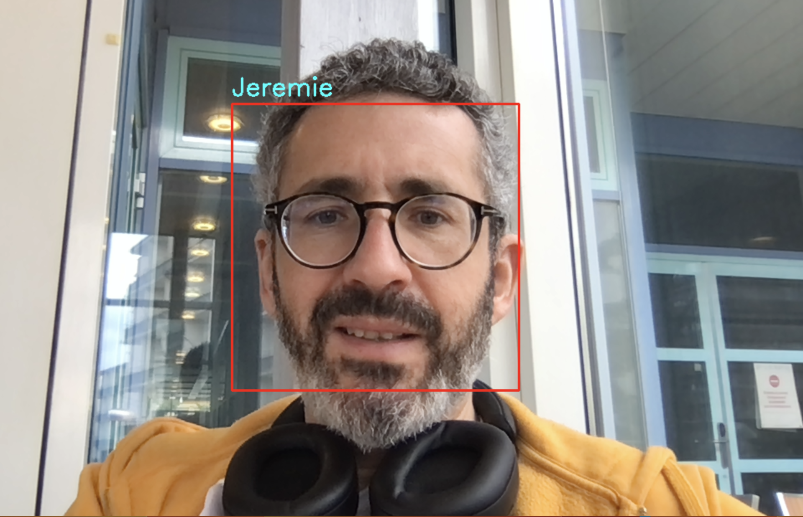

# SAÉ: Modélisation mathématique Reconnaissance faciale en temps réel

## Description du projet

Le but de cette SAÉ est de construire un système de reconnaissance faciale qui fonctionne en temps réel.

Le système utilise la caméra de votre PC (ou alors une caméra externe) pour capturer des images de visages. Ainsi, on pourra construire un **dataset** contenant des visages de différentes personnes associées à leurs noms.

Par la suite, on entraînera un **algorithme de classification** permettant de prédire le nom de la personne qui se trouve devant la caméra en fonction de son visage.

## Implémentation

Les 2 notebooks `1_dataset.ipynb`et `2_ago.ipynb` permettent d'implémenter un tel **système de reconnaissance faciale en temps réel** basé sur l'algorithme des **$k$ plus proches voisins ($k$-NN)**.

Le premier notebook implémente la création du **dataset** et le second code l'algorithme **$k$-NN** et son intégration dans un système de reconnaissance faciale en temps réel.

## Consignes

1. **Comprenez les 2 notebooks** en détails, et, si besoin, débuggez-les jusqu'à ce qu'ils fonctionnent correctement (chez moi, ils marchent).
2. **Adaptez le 2ème notebook** à d'autres algorithmes de classification de votre choix, tels que la régression logistique, les arbres de décision, etc.
3. Essayer d'adapter votre système pour le **cas d'utilisation de reconnaissance binaire** suivant: le système devra répondre `admis` ou `non admis` suivant que le visage détecté est le votre ou non.
4. Documentez-vous sur les **réseaux de neurones** et essayez d'implémenter et d'intégrer un algorithme de classification par réseaux de neurones.
5. Si vous avez le temps, documentez-vous sur les **réseaux de neurones convolutionnels** (qui sont spécialisés dans le traitement des images) et essayez d'implémenter et d'intégrer un algorithme de classification par réseaux de neurones convolutionnels.
6. Rendez votre projet sous la forme d'un **répertoire GitHub** .  Votre  repo contiendra un **fichier README** (md file) et plusieurs **notebooks jupyter** (ipynb files) propres et commentés  qui présentent votre projet.
